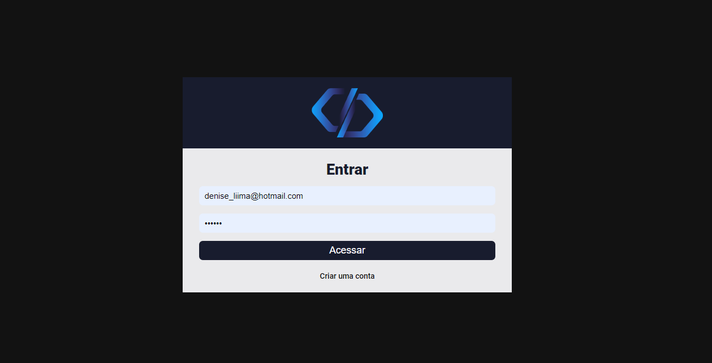

Em construção

<h1 style="text-align: center; font-weight: bold;">Sistema de Chamados</h1>

<!-- ## Demo 📸

<div align="center" >
   
</div> -->
 ---

## Sobre o Projeto
O sistema de chamados utiliza o banco de dados do Firebase para registrar informações de cadastro de usuários, tal como o Firebase Authentication para validar se o usuário está registrado ou não e/ou logado caso já tenha uma conta cadastrada.
Context API para obter e utilizar informações dos usuários em diferentes partes da aplicação.

Toda a paginação do projeto é feita com React Router Dom, contendo toda parte de registro de usuários, de cadastros, login, controle de rotas.

### Link do projeto: https://call-services.netlify.app/

### 🛠 Tecnologias
#### As seguintes ferramentas foram usadas na construção do projeto:

- [React](https://pt-br.reactjs.org/)
- [FIREBASE](https://firebase.google.com/?hl=pt)


--- 
Antes de começar, você vai precisar ter instalado em sua máquina as seguintes ferramentas:
[Git](https://git-scm.com), [Node.js](https://nodejs.org/en/).
Além disto é bom ter um editor para trabalhar com o código como [VSCode](https://code.visualstudio.com/)

### 🎲 Rodando o projeto

```bash
# Clone este repositório
$ git clone  https://github.com/deniseschirmer/sistema-de-chamados

# Acesse a pasta do projeto no terminal/cmd

# Instale as dependências
$ yarn
# ou
$ npm install

# Execute a aplicação em modo de desenvolvimento
$ yarn dev
# ou
$ npm run dev

```


<a href="https://raw.githubusercontent.com/ARTHURPC03/Proffy-FullStack/master/github/linkedin.png">
</a>
<br />

#### Made with love by: Denise Schirmer
[See my linkedIn](https://www.linkedin.com/in/denise-s-lima-schirmer-9702661ba/)